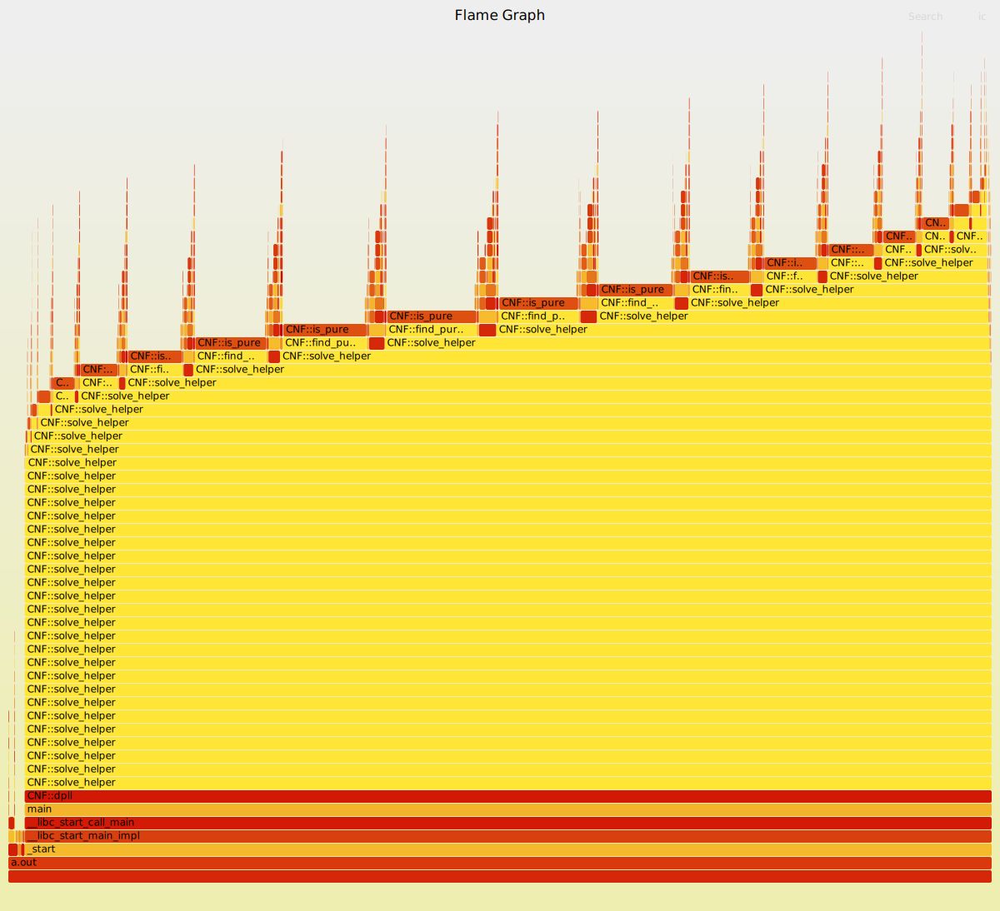

DPLL perf toy project
=====================

The goal of this toy project is to demonstrate some basic principles of
performance analysis and profiling to middle-school students.

We start with a basic working implementation of the classic DPLL algorithm
written in C++ without any performance considerations in mind: STL templates
everywhere, it's OK to have excessive memory pressure due to new/delete,
do not bother to employ custom data structures, etc. For input CNF, we use
a randomly generated formula with 200 variables and 1500 clauses. This is
a very small formula! Please note that DPLL works with arbitrary CNF,
not just 3CNF.

There is a variety of tools for you to find bottlenecks in your code.
In this mini-tutorial, we consider the most vivid way to visualize
program behavior &mdash; flame graphs. This way, every hot spot in a code
becomes apparent and easy to deal with.

We deliberately do not provide any automation such as shell scripts or
Makefiles. It is good for studying to write your own automation script.
We hope you will.

Step 0. Pre-requisites
----------------------

0. Grasp the idea of a flame graph. Read the document at
https://www.brendangregg.com/FlameGraphs/cpuflamegraphs.html
1. Install FlameGraph utility. The project is a pack of scripts, so just
grab https://github.com/brendangregg/FlameGraph repo and drop it to your
favorite location, e.g. /opt.
2. Install perf. On ubuntu with root privileges say:

```
apt install linux-tools-common
```

Step 1. Basic implementation
----------------------------

Switch to folder ``00-baseline`` and compile the code. Note that we compile
with optimization for speed, since it makes little sense to profile
a debug build. Another important option -gdwarf tells gcc to insert
DWARF debug information. This option allows our profiler to properly
build the call stack. There are other ways, though.

```
g++ -O2 -gdwarf sat.cpp
```

At first, let's evaluate the total execution time:

```
$ time ./a.out ../random.cnf
real    0m27,452s
user    0m27,447s
sys     0m0,000s
```

On my CPU it takes ~30 seconds to complete the job. Pretty much time for such
a small CNF! This justifies our intention to investigate bottlenecks in
our code. It is time to build our first flame graph now. Follow the
documentation and type:

```
sudo perf record -g ./a.out ../random.cnf
sudo chmod a+r perf.data
perf script > perf.trace
/opt/FlameGraph/stackcollapse-perf.pl perf.trace > perf.folded
/opt/FlameGraph/flamegraph.pl perf.folded > sat.svg
```

then open `sat.svg` in your favorite web browser:


This does not look like a flame graph at all! The reason is that perf did
not use the DWARF debug information we provided, so it failed to build
the call stack properly and we got junk. To fix it, we tell perf to use DWARF:

```
sudo perf record --call-graph dwarf ./a.out ../random.cnf
sudo chmod a+r perf.data
perf script > perf.trace
/opt/FlameGraph/stackcollapse-perf.pl perf.trace > perf.folded
/opt/FlameGraph/flamegraph.pl perf.folded > sat.svg
```


Good. Now the picture looks like a real flame graph, but a couple of
flames on the left looks strange. They are not rooted in \_start or
main functions. A normal single-threaded application should not behave
like that. Why did it happen? The reason is the stack size. By default,
perf collects only 8K bytes of stack, but our application consumes much more.
Telling perf to grab more stack data fixes this problem and creates
another one.

Look carefully at perf.data file generated by perf. The size is almost 900Mb.
After we increase the stack dump size, the file will consume much more space.
This huge amount of data makes us no profit. The reason is a high sampling
rate of 4KHz by default. For our toy project, even 1KHz is more than enough.

We came to the following script, and we won't change it anymore:

```
sudo perf record --call-graph dwarf,16384 -F 1000 ./a.out ../random.cnf
sudo chmod a+r perf.data
perf script > perf.trace
/opt/FlameGraph/stackcollapse-perf.pl perf.trace > perf.folded
/opt/FlameGraph/flamegraph.pl perf.folded > sat.svg
```


In this picture, you can see a series of recursive calls of CNF::solve\_helper.
Pay attention to CNF::is\_pure method &mdash; it contributes a lot to execution
time on this specific input file. Now dive into the source code:

```
    // l - signed literal
    bool is_pure(int l) const {
        bool found = false;
        for (const auto& v : clauses) {
            for (int t : v) {
                if (t == l) {
                    found = true;
                } else if (t == -l) {
                    return false;
                }
            }
        }
        return found;
    }
```

Nothing interesting. To check whether a literal is pure, one must process
every clause. This can be improved if we preprocess CNF and collect all
pure literals in one place, but before doing that, let's see where this method
is being invoked. The only place is find\_pure\_literals:

```
    set<int> find_pure_literals() const {
        set<int> ret;
        for (int i = -nvars; i <= nvars; i++) {
            if (i == 0) continue;
            if (is_pure(i)) ret.insert(i);
        }
        return ret;
    }
```

Great! We found the real culprit. A huge amount of time is wasted by walking
through the entire CNF for each literal in the initial range. Now it is
obvious that this method must be rewritten.

```
    set<int> find_pure_literals() const {
        set<int> ret;
        set<int> bad_vars;

        for (const auto& c : clauses) {
            for (int l : c) {
                if (bad_vars.find(abs(l)) != bad_vars.end()) continue;
                if (ret.find(l) != ret.end()) continue;
                if (ret.find(-l) != ret.end()) {
                    bad_vars.insert(abs(l));
                    ret.erase(-l);
                } else {
                    ret.insert(l);
                }
            }
        }
        return ret;
    }
```

Evaluate the impact of this change on execution time:

```
$ time ./a.out ../random.cnf
real    0m12,058s
user    0m12,051s
sys     0m0,004s
```

Now it takes 12 seconds vs. 30 seconds! For further analysis, proceed to
the next level.

Step 2. Improve your knowledge in tools and libraries
-----------------------------------------------------

The updated code lives in 01-pure\_literals\_fixed folder. Compile, run, and
build a flame graph using the cmds above. Then, let's analyze our new flame
graph.


In this picture, you can see that find\_pure\_literals indeed become much
less CPU-hungry. Also, it becomes clear that CNF::propagate\_var\_values
comes on stage and demands attention. Before we study propagation, let's
stare at find\_pure\_literals once again. Hmm... std::set<int>::find is slow.
If the author knew STL better, he would use unordered\_set instead
of set. Really, we do not care in which order variables are stored, we are only
interested whether the element is in a set or not.

Now, after we replace std::set with std::unordered\_set in find\_pure\_literals
and all dependent locations, we can measure the performance boost:

```
$ time ./a.out ../random.cnf
real    0m8,004s
user    0m8,002s
sys     0m0,000s
```

We gained another 4 seconds.

The lessons we learned.
* Know your tools/libs better. It may boost the performance of your code
and your productivity for free.
* Premature pessimization caused by ignorance is the root of all evil.


To be continued...
